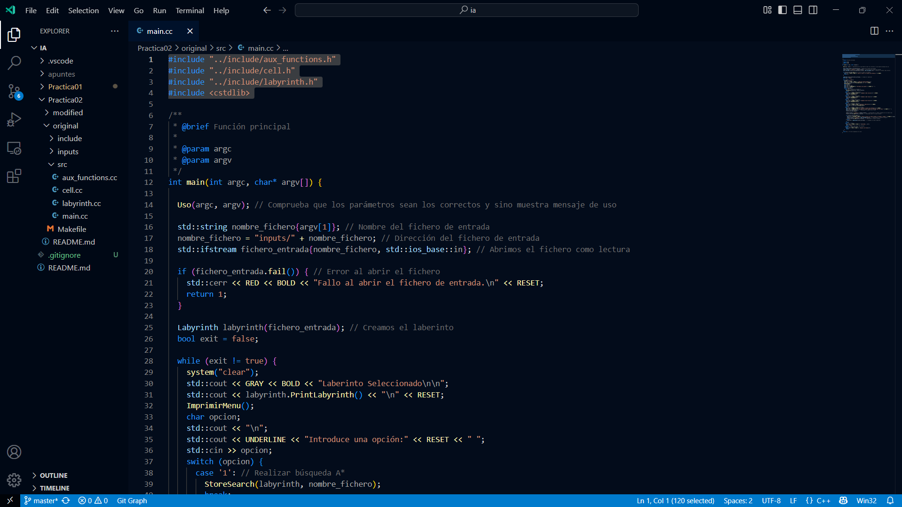

# 🚀 Space Ocean Theme

> A deep immersive coding experience blending the **vast calm of the ocean** with the **elegance of outer space**.

---

## 🌌 Preview

---

## ✨ Features

- 🧿 Eye-friendly **dark blue palette**
- 🎨 Elegant and soft **syntax contrast**
- 🛠️ Optimized for **clarity & focus**
- 🧬 Compatible with: `C++`, `Rust`, `Java`, `JS/TS`, `Python`, etc.
- ⚙️ Requires **VSCode 1.70+**

---

## 🚀 Installation

### 🔸 From Marketplace (when published)

_Search for `Space Ocean Theme` on the Extensions Marketplace._

### 🔸 Manual (.vsix)

1. Download the [`space-ocean-theme-1.0.0.vsix`](https://github.com/tomasjaves/space-ocean-theme/releases/download/v1.0.0/space-ocean-theme-1.0.0.vsix) file from the [Releases](https://github.com/tomasjaves/space-ocean-theme/releases) page.
2. Open Command Palette (Ctrl+Shift+P)
3. Select `Extensions: Install from VSIX...`
4. Choose the `.vsix` file

---

## 🛠️ Customization

All colors and tokens can be tweaked by editing the `space-ocean-theme.json`.

---

## 🙌 Feedback

If you like this theme, **star the repo** ⭐ or [open an issue](https://github.com/tomasjaves/space-ocean-theme/issues) for suggestions.

---

## 🧑‍💻 Author

Theme by [tomasjaves](https://github.com/tomasjaves)

---

## 📜 License

MIT © [tomasjaves](https://github.com/tomasjaves)

---

Enjoy the journey through the ocean of code 🌊✨

